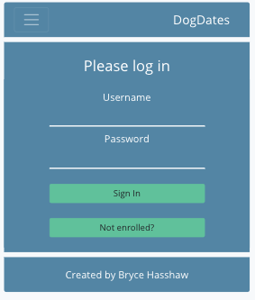
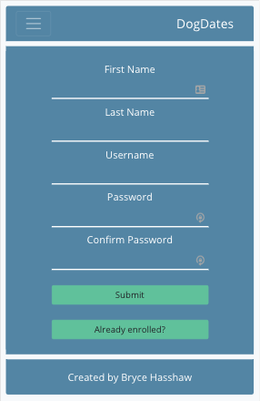
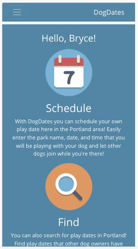
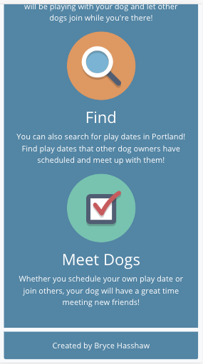
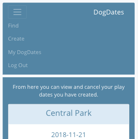
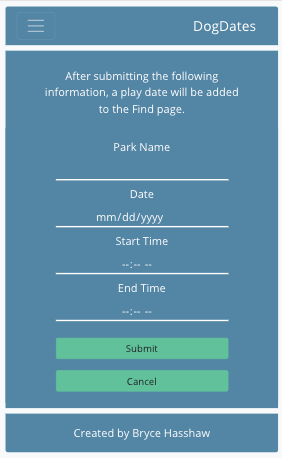
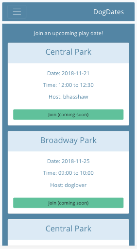
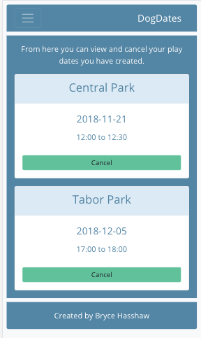

# DogDates #

Live Link: [DogDates](https://thawing-reef-84959.herokuapp.com/)
Back End Repo: [GitHub](https://github.com/bhasshaw/react-capstone-api)

## What is DogDates? ##

An application that allows dog owners to find and schedule dog play dates at local parks.

## Screenshots ##

## Technology Used ##

### Front End ###

* JavaScript
* HTML
* React
* Redux
* CSS
* Sass
* Bootstrap 4

### Back End ###

* Node.js
* Mongo
* Mongoose
* Express
* Mocha
* Chai
* bcryptjs
* Passport

### Programs ###

* Heroku
* TravisCI
* mLab
